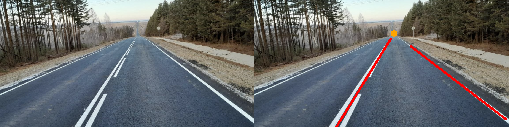

# ClassicComputerVision
Application of classical computer vision algorithms to solve problems

## Project structure
    .
    ├── input_images       # folder where the original pictures are located   
    ├── notebooks          # folder where the code files are located
    └── output_images      # folder where the result pictures are located
    
## Road marking detection
### Task:

Find the lanes in the image <b>road1.png</b> and the point of convergence of these parallel lines in the image.
### Result:

